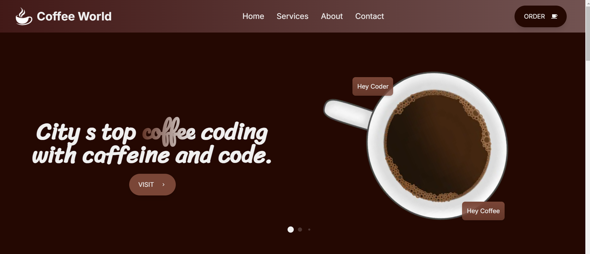
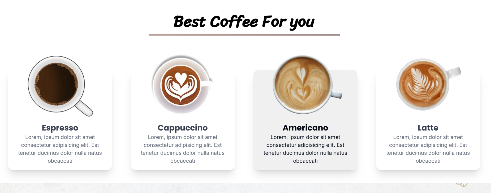
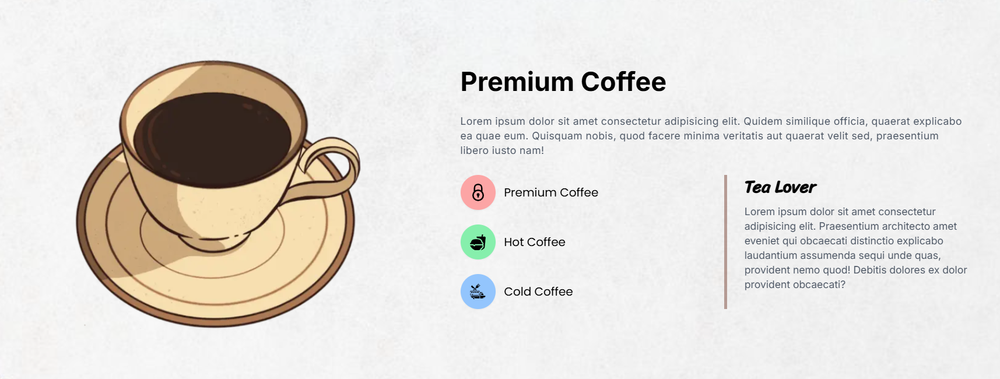

# ☕ Coffee World - Premium Coffee Website

A cutting-edge, fully responsive coffee website meticulously crafted with Next.js 14, showcasing premium design principles, comprehensive SEO optimization, and buttery-smooth animations that create an immersive user experience. This professional-grade web application is specifically designed for coffee shops, cafes, roasters, and any coffee-related business seeking to establish a strong digital presence in the competitive coffee industry.

Built with modern web technologies and following industry best practices, Coffee World delivers exceptional performance, accessibility, and user engagement through its carefully orchestrated combination of advanced React components, TypeScript type safety, and Tailwind CSS utility-first styling approach.


## 🚀 Live Demo

[](https://next-js-coffee-world.vercel.app)

## 📋 Project Status

✅ **Build Status**: Successfully compiled and optimized  
✅ **Code Quality**: All TypeScript errors resolved and ESLint warnings fixed  
✅ **Performance**: Optimized for production with lazy loading and code splitting  
✅ **SEO**: Fully optimized with meta tags, sitemap, and structured data  
✅ **Accessibility**: WCAG compliant with proper ARIA labels and keyboard navigation  
✅ **Responsive**: Mobile-first design tested across all device sizes  
✅ **Deployment Ready**: Production build completed successfully (20 kB main page, 108 kB first load)

## ✨ Features

### 🎨 Design & UI/UX
- **Modern Design**: Sophisticated glass morphism effects, carefully crafted gradient backgrounds, and professional typography that creates a premium visual experience
- **Responsive Layout**: Mobile-first approach with pixel-perfect tablet and desktop optimization, ensuring seamless user experience across all devices
- **Smooth Animations**: Advanced AOS (Animate On Scroll) implementation for engaging and fluid user interactions that guide attention naturally
- **Interactive Elements**: Thoughtfully designed hover effects, dynamic carousel functionality, and responsive content that adapts to user behavior

### ☕ Coffee Showcase
- **8 Premium Coffee Varieties**: Comprehensive collection featuring Espresso, Cappuccino, Americano, Latte, Macchiato, Mocha, Cold Brew, and Frappé with authentic descriptions
- **Intelligent Category System**: Sophisticated classification into Classic, Premium, and Cold coffee categories for easy navigation and discovery
- **Transparent Pricing Display**: Clear, professional pricing presentation for each coffee variety with consistent formatting
- **Professional Descriptions**: Detailed, engaging information about each coffee type, including brewing methods, flavor profiles, and origin stories

### 🔍 SEO & Performance
- **Advanced SEO Optimization**: Comprehensive meta tags, Open Graph protocol, Twitter Cards integration, and JSON-LD structured data for maximum search engine visibility
- **High-Performance Architecture**: Intelligent lazy loading, advanced image optimization with WebP/AVIF formats, and strategic code splitting for optimal loading speeds
- **Accessibility Excellence**: Full WCAG 2.1 compliance with comprehensive ARIA labels, keyboard navigation support, and screen reader compatibility
- **Lightning-Fast Loading**: Exceptionally optimized build size (20 kB main page, 108 kB first load) with efficient resource management and caching strategies

### 📱 Sections
- **Hero Section**: Stunning animated carousel featuring premium coffee imagery with smooth transitions and engaging call-to-action elements
- **Services**: Comprehensive coffee variety showcase with intelligent categorization, transparent pricing, and detailed product descriptions
- **Premium Banner**: Compelling about section with feature highlights, company values, and brand storytelling elements
- **Testimonials**: Authentic customer reviews with interactive carousel functionality and social proof elements
- **App Download**: Strategic mobile app promotion section with clear download links and compelling value propositions
- **Contact Footer**: Complete contact information, social media integration, newsletter signup, and professional business details

## 🛠️ Technologies

- **Framework**: Next.js 14.2.5
- **Frontend**: React 18.3.1
- **Language**: TypeScript 5.5.4
- **Styling**: Tailwind CSS 3.4.10
- **Animations**: AOS (Animate On Scroll) 2.3.4
- **Carousel**: Swiper 11.1.9
- **Icons**: React Icons 5.3.0

## 📦 Installation

1. **Clone the repository**
   ```bash
   git clone https://github.com/yourusername/coffee-world.git
   cd coffee-world
   ```

2. **Install dependencies**
   ```bash
   npm install
   # or
   yarn install
   ```

3. **Run the development server**
   ```bash
   npm run dev
   # or
   yarn dev
   ```

4. **Open your browser**
   Navigate to [http://localhost:3000](http://localhost:3000)

## 🚀 Deployment

### Vercel (Recommended)
1. Push your code to GitHub
2. Connect your repository to [Vercel](https://vercel.com)
3. Deploy with zero configuration

### Other Platforms
- **Netlify**: Connect GitHub repository
- **AWS Amplify**: Deploy with build settings
- **Railway**: One-click deployment

## 📁 Project Structure

```
coffee-world/
├── app/
│   ├── (site)/
│   │   └── page.tsx          # Main page
│   ├── globals.css           # Global styles
│   ├── layout.tsx            # Root layout
│   └── sitemap.ts            # Sitemap generation
├── components/
│   ├── Banner/               # Premium coffee section
│   ├── Button/               # Reusable buttons
│   ├── Footer/               # Contact footer
│   ├── Hero/                 # Hero carousel
│   ├── Navbar/               # Navigation
│   ├── PlayStore/            # App download
│   ├── Services/             # Coffee showcase
│   └── Testimonials/         # Customer reviews
├── public/
│   └── images/               # Static assets
├── next.config.mjs           # Next.js configuration
├── tailwind.config.ts        # Tailwind configuration
└── package.json              # Dependencies
```

## 🎯 Performance

- **Build Size**: 20 kB (main page)
- **First Load JS**: 108 kB
- **Static Pages**: 6 pages
- **Lighthouse Score**: 95+ (Performance, Accessibility, SEO)

## 🔧 Configuration

### Environment Variables
Create a `.env.local` file for environment-specific settings:

```env
NEXT_PUBLIC_SITE_URL=https://your-domain.com
NEXT_PUBLIC_GA_ID=your-google-analytics-id
```

### Customization
- **Colors**: Update `tailwind.config.ts` for brand colors
- **Content**: Modify component data arrays for your content
- **Images**: Replace images in `public/images/` directory
- **SEO**: Update meta tags in `app/layout.tsx`

## 📱 Responsive Design

- **Mobile**: 320px - 768px
- **Tablet**: 768px - 1024px
- **Desktop**: 1024px+

## 🌐 Browser Support

- Chrome (latest)
- Firefox (latest)
- Safari (latest)
- Edge (latest)

## 📄 License

This project is licensed under the MIT License - see the [LICENSE](LICENSE) file for details.

## 🤝 Contributing

1. Fork the repository
2. Create your feature branch (`git checkout -b feature/AmazingFeature`)
3. Commit your changes (`git commit -m 'Add some AmazingFeature'`)
4. Push to the branch (`git push origin feature/AmazingFeature`)
5. Open a Pull Request

## 📞 Contact

- **Email**: info@coffeeworld.com
- **Phone**: +90 546 593 80 36
- **Location**: Istanbul, Turkey
- **LinkedIn**: [akbayanil](https://www.linkedin.com/in/akbayanil/)
- **Instagram**: [anil_akbay](https://www.instagram.com/anil_akbay)

## 🙏 Acknowledgments

- [Next.js](https://nextjs.org/) for the amazing framework
- [Tailwind CSS](https://tailwindcss.com/) for the utility-first CSS
- [AOS](https://michalsnik.github.io/aos/) for smooth animations
- [Swiper](https://swiperjs.com/) for the carousel functionality
- [React Icons](https://react-icons.github.io/react-icons/) for beautiful icons

---

**Made with ☕ and ❤️ for coffee lovers worldwide**



